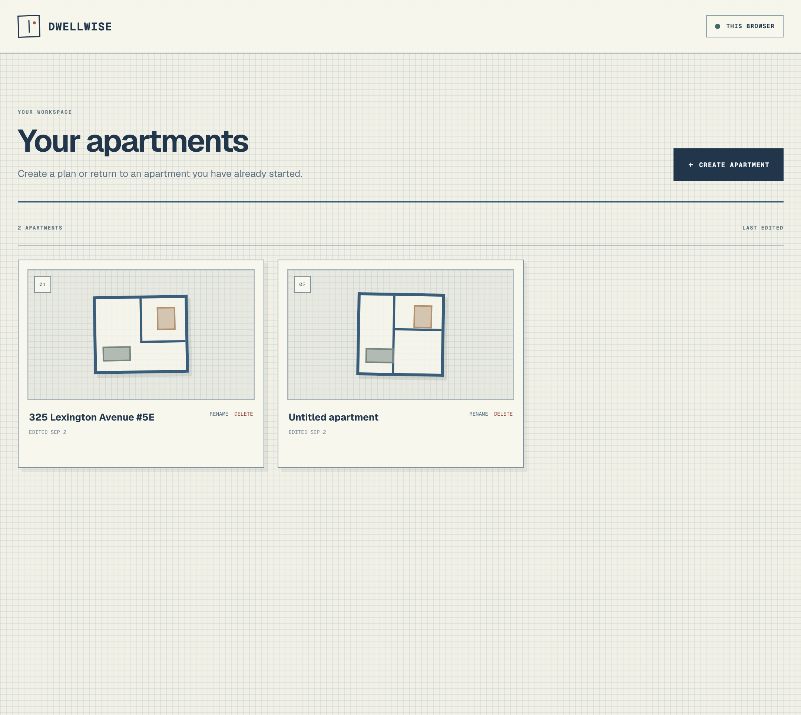
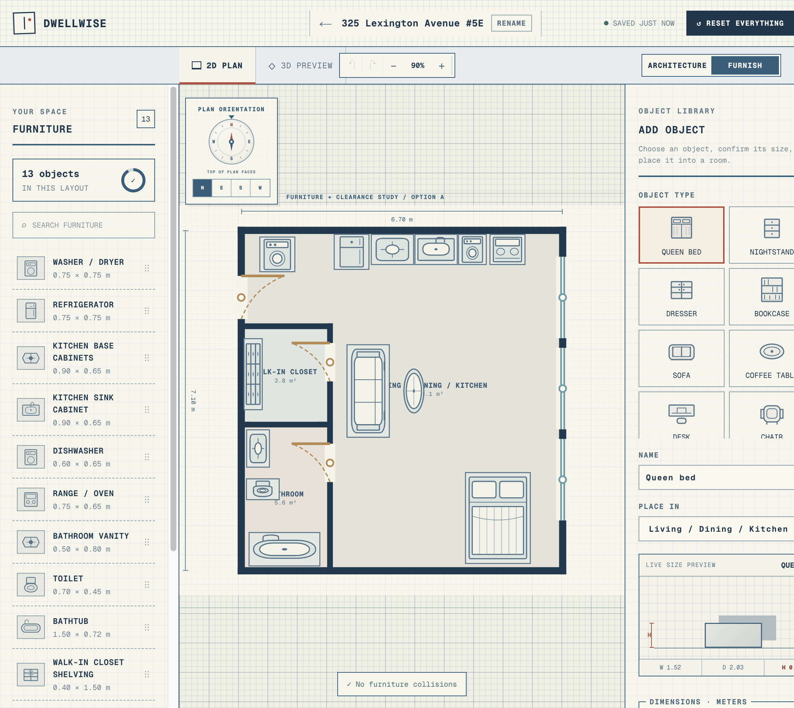
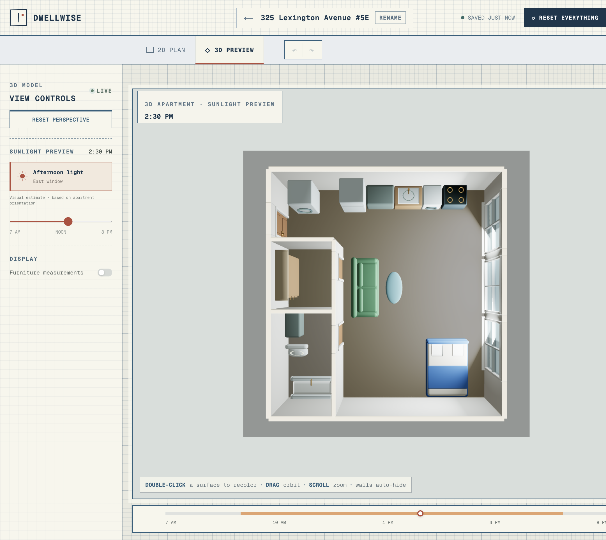
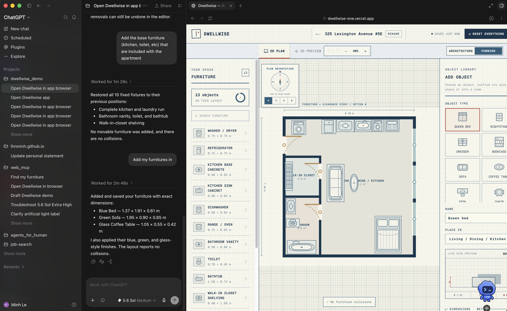
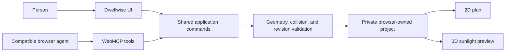

# Dwellwise

> Know whether an apartment fits your life before you sign.

Dwellwise is an agent-ready apartment planner for testing a real layout before committing to it. Draw the apartment in 2D, reshape its walls, doors, and windows, furnish it with real-world dimensions, and inspect the result in a live 3D sunlight preview.

[Open Dwellwise](https://dwellwise-one.vercel.app/)

## Demo









## What you can do

- Create private apartment projects that stay available in the same browser.
- Draw, resize, and reshape an exterior footprint; add interior walls, doors, and windows.
- Add, move, rotate, resize, and remove furniture from a dimensioned catalog.
- Check room areas, furniture fit, collisions, and clearance in a shared 2D plan.
- Preview the same apartment in 3D, recolor supported surfaces, and explore illustrative sunlight throughout the day.
- Undo and redo saved editor changes.

## Quick start

```bash
git clone https://github.com/lhnminh/dwellwise.git
cd dwellwise
npm install
cp .env.example .env.local
npm run dev
```

Set `DATABASE_URL` in `.env.local` to a PostgreSQL connection string, then open [http://localhost:3000](http://localhost:3000). Dwellwise creates its anonymous browser profile and project tables on first use.

Requirements: Node.js 22 and PostgreSQL. Never commit `.env.local` or a real connection string.

## A two-minute tour

1. Create an apartment from the dashboard.
2. In **Architecture**, resize the footprint or add an interior wall, then place doors and windows on their host walls.
3. Switch to **Furnish** and add furniture with the dimensions you actually need.
4. Open **3D Preview** to inspect the same saved layout and move the sunlight time through the day.
5. Use the editor’s undo and redo controls to compare alternatives without losing your work.

## WebMCP: agent-ready by design

Dwellwise uses the experimental browser WebMCP API (`document.modelContext`) to expose page-scoped, semantic tools to compatible browser agents. An agent can work through the same validated application commands as a person rather than guessing at controls or simulating pointer movement. Browsers without WebMCP retain the complete normal interface.

On the dashboard, agents can inspect, create, rename, and open apartments. In an editor, they can inspect and modify furniture and architecture, reshape the exterior, adjust finishes and the preview, and use undo/redo.



The WebMCP boundary is intentionally narrow:

- Tools operate only on the project already open in the browser.
- Saved agent edits use the same validation, revision checks, mutation queue, history, and visible updates as UI edits.
- Tools never receive cookies, owner IDs, raw database access, arbitrary URLs, or unrestricted scene-document writes.
- Destructive actions open an in-app confirmation for a person to complete.

To run the human interface without registering WebMCP tools:

```bash
NEXT_PUBLIC_WEBMCP_ENABLED=false
```

## How it works

Dwellwise keeps one scene document for the plan, persistence layer, and renderer. Architecture is defined by walls, exterior corners, and openings; rooms are derived from closed regions; furniture instances reference a reusable catalog and carry their own position, rotation, dimensions, and room assignment. This keeps 2D editing, 3D rendering, fit checks, and saving on one consistent meter-based coordinate system.

Every saved change is revision-checked. If another tab has changed the project, the stale write is rejected instead of silently overwriting the newer version.

Sunlight is a visual planning aid, not a quantitative daylight analysis or a building-code assessment.

## Quality checks

```bash
npm test
npm run lint
npx tsc --noEmit
npm run build
```

## Tech stack

- Next.js 16, React 19, and TypeScript
- Three.js with React Three Fiber for the 3D preview
- PostgreSQL through the Neon serverless driver
- WebMCP for optional browser-native agent tools

## Documentation

- **Current implementation:** [editor tool registry](app/webmcp/editor-tools.ts), [dashboard tool registry](app/webmcp/dashboard-tools.ts), and [backend model](docs/BACKEND.md).
- **WebMCP design history:** [integration PRD](docs/PRD-WEBMCP-INTEGRATION.md) and [full-parity PRD](docs/PRD-WEBMCP-FULL-PARITY.md). These describe the original MVP and parity decisions; the tool registries above are the current source of truth.
- **Future product proposals:** [custom apartment geometry PRD](docs/PRD-CUSTOM-APARTMENT-GEOMETRY.md) and [3D preview and model uploads PRD](docs/PRD-3D-PREVIEW-AND-MODEL-UPLOADS.md). These are drafts, not promises of currently available features.
- **Deployment:** [Vercel deployment guide](docs/VERCEL.md).

## Data and privacy

Projects belong to an anonymous, secure, HTTP-only browser profile. The project API verifies that ownership on every request and responds with `404` when another browser attempts to access a project it does not own. Clearing browser data removes access to that anonymous profile; Dwellwise does not provide accounts, sharing, or cross-device synchronization.
